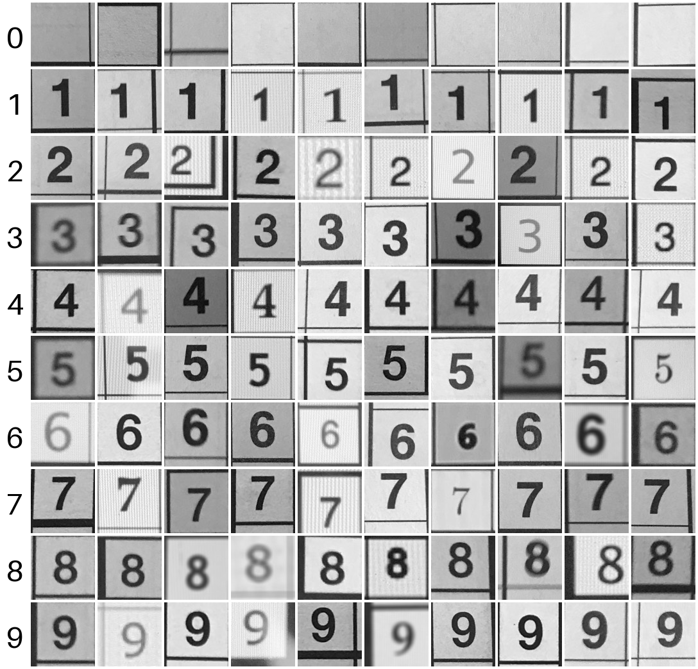

# Sudoku MNIST

A drop-in, MNIST-style dataset of **34,386** digit images cropped from real photographs of Sudoku boards — **100×100** grayscale, ten classes (`0`–`9`, where `0` is an empty cell).

Where MNIST is handwritten digits on a clean background, Sudoku MNIST is digits **in the wild**: printed in different fonts and weights, lit unevenly, sitting inside grid lines, with shadows and paper texture. That makes it a small but surprisingly real-world classification problem — and a one-line drop-in anywhere you'd use MNIST.



*Ten random samples from each class. Row `0` is empty cells; rows `1`–`9` are the printed digits.*

## The story

I built this dataset by hand for my **[WWDC 2019 Scholarship submission](https://www.youtube.com/watch?v=2YF921kagrI)** — an app that reads a Sudoku board from a photo and solves it.

[](https://www.youtube.com/watch?v=2YF921kagrI)

To train the digit recognizer, I photographed every Sudoku board myself, cropped each one into its individual cells, and **hand-classified all 34,386 images** into the right digit folder. No synthetic data, no scraping — every single label was placed by hand.

## Quick start

```bash
pip install -r requirements.txt
```

```python
from sudoku_mnist import load_data

(x_train, y_train), (x_test, y_test) = load_data()
# x_train: (29229, 100, 100) uint8, values 0-255
# y_train: (29229,)          uint8, values 0-9
```

That's it. The shape and dtype mirror `keras.datasets.mnist`, so existing MNIST code mostly just works (note the larger 100×100 images).

## How it works

The dataset ships as a single compressed file, `sudoku_mnist.npz` (~222 MB), hosted on the [GitHub Release](https://github.com/nikolasgioannou/sudoku-mnist/releases) — **not** committed to git. There's no need to download 34k individual image files.

On the first call, `load_data()`:

1. downloads `sudoku_mnist.npz` from the Release,
2. verifies its **SHA-256** against the expected checksum (corrupt or partial downloads fail loudly),
3. caches it under `~/.cache/sudoku_mnist/`.

Every later call loads straight from that cache. If a copy of `sudoku_mnist.npz` already sits next to your code, it's used directly and nothing is downloaded.

Inside the `.npz` are four arrays — `x_train`, `y_train`, `x_test`, `y_test` — the same keys Keras's MNIST loader produces.

## Dataset details

| | |
|---|---|
| Images | 34,386 |
| Resolution | 100 × 100, grayscale (8-bit) |
| Classes | 10 (`0`–`9`; `0` = empty cell) |
| Train / test | 29,229 / 5,157 (stratified 85/15, seed 42) |
| File | `sudoku_mnist.npz` (~222 MB) |
| SHA-256 | `410d3eee021d542e485bf42c30b6215f0840d255b10e55228be2e0c91c427440` |

Per-class counts (train / test):

| Digit | 0 | 1 | 2 | 3 | 4 | 5 | 6 | 7 | 8 | 9 |
|---|---|---|---|---|---|---|---|---|---|---|
| train | 13320 | 1763 | 1718 | 1730 | 1737 | 1735 | 1778 | 1812 | 1828 | 1808 |
| test | 2350 | 311 | 303 | 305 | 307 | 306 | 314 | 320 | 322 | 319 |

> **Class imbalance:** `0` (empty cells) is by far the majority class — a Sudoku board is mostly empty. Weight your loss or resample accordingly.

## How it was made (pipeline)

1. **Photograph** every Sudoku board.
2. **Crop** each board into its 81 cells, keeping only the cells used.
3. **Hand-classify** each cell image into `0`–`9`.
4. **Square-crop + resize** every image to 100×100 (center crop to a square, then downscale — no stretching).
5. **Grayscale + pack** all images into `sudoku_mnist.npz` with a deterministic, stratified train/test split.

Steps 4–5 are reproducible with `build_npz.py`:

```bash
pip install -r requirements.txt
python build_npz.py        # reads data/<digit>/*.jpg -> writes sudoku_mnist.npz
```

The split uses a fixed seed (42), so the output is byte-for-byte reproducible.

## Files

- `sudoku_mnist.py` — one-line loader (`load_data()`).
- `build_npz.py` — rebuilds `sudoku_mnist.npz` from the source image folders.
- `requirements.txt` — `numpy`, `Pillow`.
- `sudoku_mnist.npz.sha256` — checksum for integrity verification.

## License

[MIT](LICENSE) — code and dataset. Attribution appreciated.
